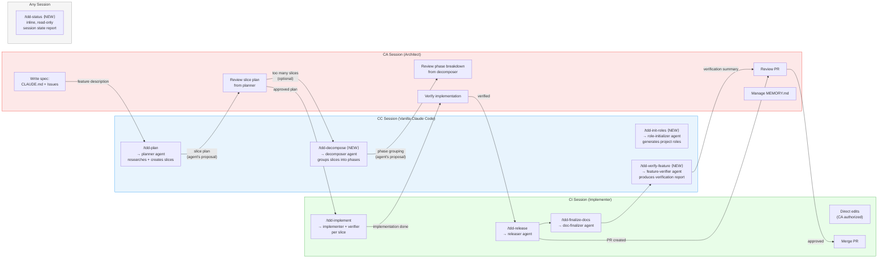
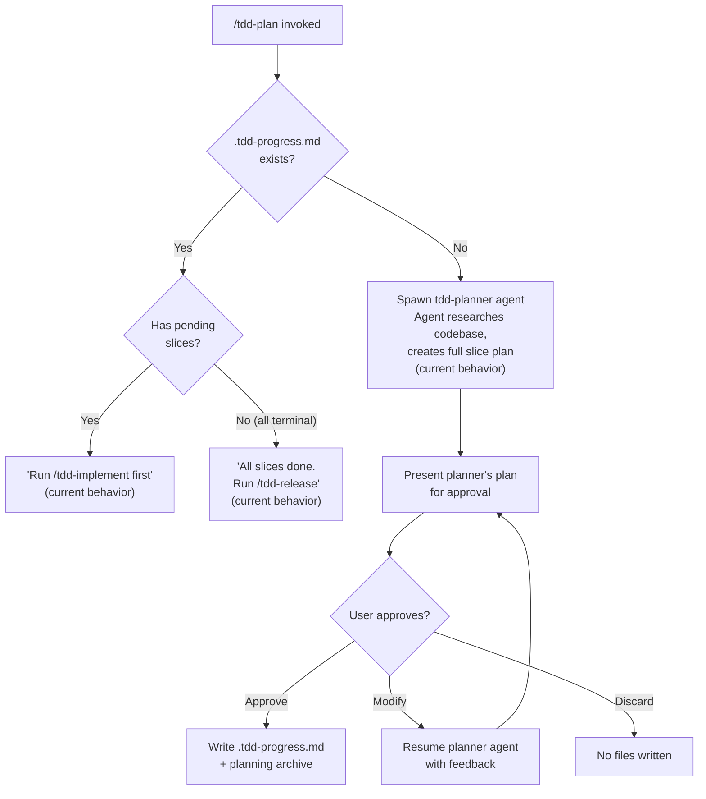
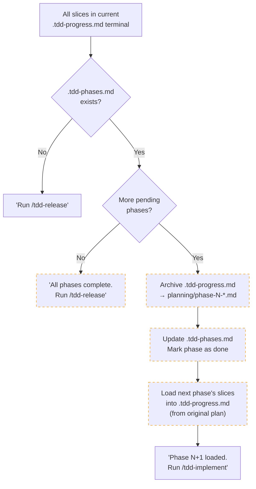
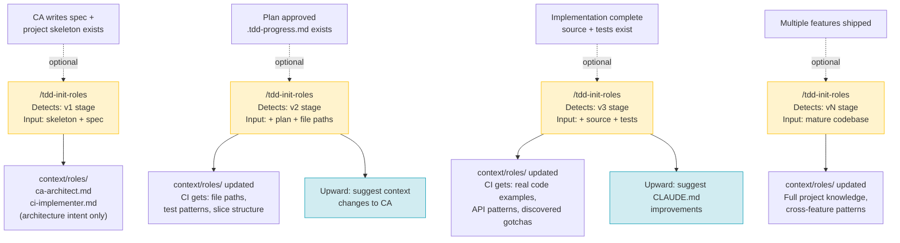
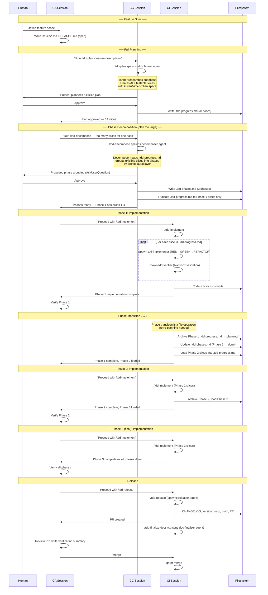

# Proposed TDD Workflow — Visual Reference

> **Date:** 2026-03-15 (revised)
> **Purpose:** Visual representation of the proposed workflow modifications
> for review before implementation. Incorporates all concepts from this
> exploration session.
>
> **Diagrams use Mermaid syntax** — render on GitHub or any Mermaid viewer.
>
> **Key principle:** The tdd-planner agent (spawned by `/tdd-plan`) is
> what researches the codebase and creates the slice plan. CA/human
> provides the feature description and reviews the result. If the plan
> has too many slices, `/tdd-decompose` groups them into phases after
> the fact — it does not create slices itself.

---

## 1. Overall Feature Lifecycle (End-to-End)

Each step shows the **agent** that does the work and its **deliverable**.
`/tdd-plan` always runs first. If the resulting plan has too many slices,
`/tdd-decompose` groups them into phases. Dashed boxes are new/modified.

```mermaid
flowchart TD
    START([Feature Request]) --> SPEC["CA + Human Dialogue<br/>─────────────────<br/>Deliverable: CLAUDE.md, issues/*.md"]

    SPEC --> PLAN["/tdd-plan<br/>Agent: tdd-planner<br/>─────────────────<br/>Deliverable: .tdd-progress.md<br/>(all slices with Given/When/Then)"]

    PLAN --> CA_REVIEW[CA Reviews<br/>Planner's Slice Plan]
    CA_REVIEW -->|Approve| DECOMPOSE_CHECK{Too many slices<br/>for one pass?}
    CA_REVIEW -->|Modify| PLAN

    DECOMPOSE_CHECK -.->|"Yes (optional)"| DECOMPOSE["/tdd-decompose ⟨NEW⟩<br/>Agent: decomposer<br/>─────────────────<br/>Deliverable: .tdd-phases.md<br/>(groups slices into phases,<br/>truncates .tdd-progress.md<br/>to Phase 1 only)"]
    DECOMPOSE_CHECK -->|No| IMPLEMENT

    DECOMPOSE --> CA_PHASES[CA Reviews<br/>Phase Grouping]
    CA_PHASES -->|Approve| IMPLEMENT
    CA_PHASES -->|Modify| DECOMPOSE

    IMPLEMENT["/tdd-implement<br/>Agents: implementer + verifier (per slice)<br/>─────────────────<br/>Deliverable: code + tests + commits"]

    IMPLEMENT --> PHASE_CHECK{".tdd-phases.md exists<br/>with more phases?"}

    PHASE_CHECK -->|"Yes → archive completed phase,<br/>load next phase's slices<br/>into .tdd-progress.md"| IMPLEMENT

    PHASE_CHECK -->|No phases or<br/>all phases done| RELEASE["/tdd-release<br/>Agent: tdd-releaser<br/>─────────────────<br/>Deliverable: CHANGELOG,<br/>version bump, push, PR"]

    RELEASE --> FINALIZE["/tdd-finalize-docs<br/>Agent: tdd-doc-finalizer<br/>─────────────────<br/>Deliverable: updated README,<br/>CLAUDE.md, docs/"]
    FINALIZE --> VERIFY["/tdd-verify-feature ⟨NEW⟩<br/>Agent: feature-verifier<br/>─────────────────<br/>Deliverable: verification<br/>summary for PR body"]
    VERIFY --> CA_PR[CA Reviews PR]
    CA_PR --> MERGE["CI Merges PR"]
    MERGE --> DONE([Feature Shipped])

    style VERIFY stroke-dasharray: 5 5,stroke:#f90

    style DECOMPOSE stroke-dasharray: 5 5,stroke:#f90
    style PHASE_CHECK stroke-dasharray: 5 5,stroke:#f90
```



**Notes:**
- **`/tdd-plan` runs first.** The planner agent researches the codebase and
  creates ALL slices. CA reviews the result.
- **`/tdd-decompose` runs after planning**, only if the plan is too large.
  It groups the planner's existing slices into phases and truncates
  `.tdd-progress.md` to the first phase. It does NOT create slices.
- **Phase loop:** After implementing a phase, the completed phase is
  archived and the next phase's slices (already created by the planner)
  are loaded into `.tdd-progress.md`. No re-planning needed — the loop
  goes straight back to `/tdd-implement`.
- `/tdd-init-roles` is optional at any point — see Diagram 5.
- Within `/tdd-implement`, the verifier runs after each slice (internal
  detail of the skill).

---

## 2. Session Roles and Responsibilities

Shows which session (CA, CC, CI) owns each step. CP is retired. The key
insight: CC sessions run the plugin skills that spawn agents to do the
actual work. CA provides specs and reviews results. CI executes the
approved plan.



**Notes:**
- **CC is disposable.** Open, run the skill (which spawns the agent to do
  the work), close. The plugin provides everything needed — no role prompt.
- **CA and CI are persistent.** They live across all phases of a feature.
- The arrow labels emphasize that plans and breakdowns are **agent proposals**
  that CA reviews — not CA's own work product.
- **`/tdd-status`** (proposed) can be run from any session.
- **`/tdd-init-roles`** could be run from any session but CC is the
  natural home.

---

## 3. Phase Transition Detail

The lifecycle of `.tdd-progress.md` and `.tdd-phases.md` across phase
boundaries. The non-phased (single-plan) path is also shown.

```mermaid
stateDiagram-v2
    [*] --> NoFiles: Project start

    state "Non-Phased Path" as NonPhased {
        NoFiles --> ProgressOnly: /tdd-plan\n(planner creates slices)
        note right of ProgressOnly: .tdd-progress.md created
        ProgressOnly --> Implementing_NP: /tdd-implement
        Implementing_NP --> AllDone_NP: All slices terminal
        AllDone_NP --> Released: /tdd-release
    }

    state "Phased Path" as Phased {
        NoFiles --> FullPlan: /tdd-plan\n(planner creates ALL slices)
        note right of FullPlan: .tdd-progress.md with all slices

        FullPlan --> BothFiles: /tdd-decompose\n(groups slices into phases)
        note right of BothFiles: .tdd-phases.md created\n.tdd-progress.md truncated\nto Phase 1 slices only

        BothFiles --> Implementing: /tdd-implement
        Implementing --> PhaseComplete: All phase slices terminal

        PhaseComplete --> NextPhase: Archive completed phase,\nload next phase's slices\ninto .tdd-progress.md
        PhaseComplete --> AllPhasesComplete: Last phase done

        NextPhase --> Implementing

        AllPhasesComplete --> Released: /tdd-release
    }

    Released --> [*]
    note right of Released: .tdd-progress.md archived\n.tdd-phases.md: all done\n(if phased)
```

---

## 4. Decision Trees

### 4a. `/tdd-plan` — Creates the slice plan (runs once per feature)



### 4b. Phase transition (after each phase completes)

The phase transition is a lightweight file operation — no re-planning.
The planner already created all slices. This could be handled by
`/tdd-implement` (auto-advance) or a separate mechanism.



---

## 5. `/tdd-init-roles` Iterative Lifecycle

Shows when role generation/refinement can occur. Each invocation is
**optional** — the workflow functions without it. The role-initializer
agent researches whatever context exists and produces the best roles
it can.



**Key properties:**
- **Idempotent:** Each invocation diffs against existing roles, shows changes,
  asks for approval before writing.
- **Stage detection is automatic:** The skill infers the lifecycle stage from
  what files exist (skeleton only → v1, plan exists → v2, code exists → v3).
- **Two output files only:** CA + CI roles. CP is retired.
- **Bidirectional:** Generates role files *down*, suggests context improvements
  *up* to CA.

---

## 6. Component Map (Current vs. Proposed)

```
┌─────────────────────────────────────────────────────────────────────┐
│                    tdd-workflow Plugin                              │
│                                                                     │
│  AGENTS (subagents — do the actual work)                            │
│  ┌──────────────┐ ┌───────────────┐ ┌──────────────┐               │
│  │ tdd-planner   │ │tdd-implementer│ │ tdd-verifier │               │
│  │ (opus, plan)  │ │ (opus, write) │ │(haiku, plan) │               │
│  │ Researches    │ │ RED→GREEN→    │ │ Blackbox     │               │
│  │ codebase,     │ │ REFACTOR      │ │ validation   │               │
│  │ creates slices│ │               │ │              │               │
│  └──────────────┘ └───────────────┘ └──────────────┘               │
│  ┌──────────────┐ ┌───────────────┐ ┌───────────────┐              │
│  │ tdd-releaser  │ │tdd-doc-       │ │context-updater│              │
│  │(sonnet, bash) │ │finalizer      │ │ (opus, write) │              │
│  │              │ │(sonnet, edit) │ │               │              │
│  └──────────────┘ └───────────────┘ └───────────────┘              │
│  ┌ ─ ─ ─ ─ ─ ─ ─┐ ┌ ─ ─ ─ ─ ─ ─┐ ┌ ─ ─ ─ ─ ─ ─ ─┐              │
│  │role-initializer│ │ decomposer   │ │feature-       │  ⟨NEW⟩       │
│  │ (opus, write)  │ │ (opus, read) │ │ verifier      │  agents      │
│  │ Researches     │ │ Proposes     │ │(haiku, read)  │              │
│  │ project, gen.  │ │ phase        │ │ Runs quality  │              │
│  │ role files     │ │ breakdown    │ │ gates, reports│              │
│  └ ─ ─ ─ ─ ─ ─ ─┘ └ ─ ─ ─ ─ ─ ─┘ └ ─ ─ ─ ─ ─ ─ ─┘              │
│                                                                     │
│  SKILLS (user-invocable — orchestrate agents)                       │
│  ┌─────────────┐ ┌──────────────┐ ┌──────────────┐                 │
│  │ /tdd-plan    │ │/tdd-implement │ │ /tdd-release  │                │
│  │ (fork→plan.) │ │ (inline)     │ │(fork→release.)│                │
│  │ Spawns       │ │ Spawns impl. │ │              │                │
│  │ planner agent│ │ + verifier   │ │              │                │
│  └─────────────┘ └──────────────┘ └──────────────┘                 │
│  ┌──────────────┐ ┌──────────────┐                                  │
│  │/tdd-finalize- │ │/tdd-update-  │                                  │
│  │  docs         │ │  context     │                                  │
│  └──────────────┘ └──────────────┘                                  │
│  ┌ ─ ─ ─ ─ ─ ─ ┐ ┌ ─ ─ ─ ─ ─ ─┐ ┌ ─ ─ ─ ─ ─ ─ ┐                │
│  │/tdd-decompose │ │/tdd-init-   │ │ /tdd-status   │  ⟨NEW⟩ skills  │
│  │ Spawns        │ │  roles      │ │ (inline,      │                │
│  │ decomposer   │ │ Spawns      │ │  read-only)   │                │
│  └ ─ ─ ─ ─ ─ ─ ┘ │ role-init.  │ └ ─ ─ ─ ─ ─ ─ ┘                │
│                    └ ─ ─ ─ ─ ─ ─┘                                   │
│  ┌ ─ ─ ─ ─ ─ ─ ─ ─ ─ ┐ ┌ ─ ─ ─ ─ ─ ─┐ ┌ ─ ─ ─ ─ ─ ─┐          │
│  │/tdd-verify-feature   │ │ /role-ca    │ │ /role-ci    │           │
│  │ Spawns feature-      │ │ (inline,    │ │ (inline,    │ ⟨NEW⟩     │
│  │ verifier             │ │  deferred)  │ │  deferred)  │ skills    │
│  └ ─ ─ ─ ─ ─ ─ ─ ─ ─ ┘ └ ─ ─ ─ ─ ─ ─┘ └ ─ ─ ─ ─ ─ ─┘          │
│                                                                     │
│  SKILLS (auto-loaded, not user-invocable)                           │
│  ┌─────────────┐ ┌──────────────┐ ┌──────────────┐ ┌─────────────┐ │
│  │dart-flutter- │ │cpp-testing-  │ │bash-testing-  │ │c-conventions│ │
│  │ conventions  │ │ conventions  │ │ conventions   │ │             │ │
│  └─────────────┘ └──────────────┘ └──────────────┘ └─────────────┘ │
│                                                                     │
│  FILES (state tracking)                                             │
│  ┌──────────────────┐ ┌ ─ ─ ─ ─ ─ ─ ─ ─ ┐                         │
│  │.tdd-progress.md   │ │.tdd-phases.md     │  ⟨NEW⟩                  │
│  │(slices created by  │ │(phases created by  │                        │
│  │ planner agent,     │ │ decomposer agent,  │                        │
│  │ ephemeral per plan)│ │ persistent per     │                        │
│  │                    │ │ feature)           │                        │
│  └──────────────────┘ └ ─ ─ ─ ─ ─ ─ ─ ─ ┘                         │
│                                                                     │
│  HOOKS (in hooks.json)                                              │
│  ┌───────────────────────────────────────┐                          │
│  │ SubagentStart:                        │                          │
│  │   context-updater → git context inj.  │                          │
│  │                                       │                          │
│  │ SubagentStop:                         │                          │
│  │   tdd-implementer → R-G-R validation  │                          │
│  │   tdd-releaser    → release check     │                          │
│  │   tdd-doc-final.  → release check     │                          │
│  │                                       │                          │
│  │ Stop:                                 │                          │
│  │   check-tdd-progress.sh               │                          │
│  │                                       │                          │
│  │ ┌ ─ ─ ─ ─ ─ ─ ─ ─ ─ ─ ─ ─ ─ ─ ─ ┐  │                          │
│  │ │SessionStart: TDD session detect  │  │  ⟨NEW⟩                   │
│  │ └ ─ ─ ─ ─ ─ ─ ─ ─ ─ ─ ─ ─ ─ ─ ─ ┘  │                          │
│  └───────────────────────────────────────┘                          │
│                                                                     │
│  HOOKS (in agent frontmatter, not hooks.json)                       │
│  ┌───────────────────────────────────────┐                          │
│  │ tdd-implementer:                      │                          │
│  │   PreToolUse  → validate-tdd-order.sh │                          │
│  │   PostToolUse → auto-run-tests.sh     │                          │
│  │ tdd-planner:                          │                          │
│  │   PreToolUse  → planner-bash-guard.sh │                          │
│  └───────────────────────────────────────┘                          │
│                                                                     │
│  UTILITIES (standalone scripts, not hooks)                          │
│  ┌───────────────────────────────────────┐                          │
│  │ validate-plan-output.sh               │                          │
│  │ detect-project-context.sh             │                          │
│  │ bump-version.sh                       │                          │
│  └───────────────────────────────────────┘                          │
│                                                                     │
│  ROLE DOCS (reference, not plugin components)                       │
│  ┌─────────────────────────────────────────┐                        │
│  │ docs/dev-roles/ca-architect.md  (generic)                        │
│  │ docs/dev-roles/ci-implementer.md (generic)                       │
│  │ docs/dev-roles/cp-planner.md    (deprecated — use /tdd-plan)     │
│  └─────────────────────────────────────────┘                        │
│                                                                     │
│  PER-PROJECT OUTPUT (generated by role-initializer agent)           │
│  ┌ ─ ─ ─ ─ ─ ─ ─ ─ ─ ─ ─ ─ ─ ─ ─ ─ ─ ─ ┐                        │
│  │ <project>/context/roles/ca-architect.md  │  ⟨NEW⟩                │
│  │ <project>/context/roles/ci-implementer.md│                       │
│  └ ─ ─ ─ ─ ─ ─ ─ ─ ─ ─ ─ ─ ─ ─ ─ ─ ─ ─ ┘                        │
│                                                                     │
└─────────────────────────────────────────────────────────────────────┘

Legend:  ┌──────┐ = existing     ┌ ─ ─ ─┐ = proposed new
```

---

## 7. Phased Planning Sequence (Detailed)

A complete walkthrough of a 3-phase feature. The planner creates all
slices first, then the decomposer groups them into phases.



---

## 8. File Lifecycle Across Phases

```
Time →
────────────────────────────────────────────────────────────────────→

.tdd-progress.md:
  ┌─ALL slices──────┐
  │ created by       │  /tdd-decompose
  │ planner agent    │  truncates to
  │ (full plan)      │  Phase 1 only
  └────────┬─────────┘
           ▼
  ┌─Phase 1 slices─┐           ┌─Phase 2 slices─┐     ┌─Phase 3─┐
  │ consumed by     │ archived  │ loaded from     │ arch│ loaded  │ archived
  │ /tdd-implement  │ by next   │ original plan   │ by  │ from    │ by
  │                 │ /tdd-impl │ by /tdd-impl    │ next│ original│ /tdd-
  │                 │ ────→     │ consumed by     │ ──→ │ plan    │ release
  │                 │ planning/ │ /tdd-implement  │     │         │ ──→
  └─────────────────┘           └─────────────────┘     └─────────┘
                                                                  planning/

.tdd-phases.md (persistent, per-feature):
  Created by decomposer (after planner) ─────────────────────────→
  [Phase 1: pending]    [Phase 1: done]     [Phase 2: done]     [all done]
                        ↑ updated by        ↑ updated by
                        /tdd-implement      /tdd-implement

planning/ directory (archives):
                      phase-1-*.md          phase-2-*.md    phase-3-*.md
                      (archived)            (archived)      (archived)

Feature branch (single branch, all phases):
  ┌──created by /tdd-implement (Phase 1) ─────────────────pushed──→ PR
  │  Phase 2 and 3 commits added to same branch
```

---

## 9. Three-Session Model (Revised)

```
┌──────────────────────────────────────────────────────────┐
│                     HUMAN DEVELOPER                       │
│                                                           │
│  Provides: feature ideas, feedback, approvals, judgment   │
│  Receives: agent proposals (plans, phases, roles)         │
└─────────┬──────────────────┬──────────────────┬──────────┘
          │                  │                  │
          ▼                  ▼                  ▼
┌──────────────┐  ┌──────────────┐  ┌──────────────┐
│  CA Session   │  │  CC Session   │  │  CI Session   │
│  (Architect)  │  │  (No role)    │  │  (Implementer)│
│              │  │              │  │              │
│ Role file:   │  │ No role file │  │ Role file:   │
│ context/     │  │ Plugin gives │  │ context/     │
│ roles/       │  │ everything   │  │ roles/       │
│ ca-arch...md │  │ needed       │  │ ci-impl...md │
│              │  │              │  │              │
│ Owns:        │  │ Runs:        │  │ Runs:        │
│ • Spec       │  │ • /tdd-plan  │  │ • /tdd-      │
│ • Decisions  │  │   (planner   │  │   implement  │
│ • Issues     │  │    creates   │  │ • /tdd-      │
│ • Memory     │  │    slices)   │  │   release    │
│ • Verify     │  │ • /tdd-      │  │ • /tdd-      │
│              │  │   decompose  │  │   finalize-  │
│ Reviews:     │  │   (decomposer│  │   docs       │
│ • Planner's  │  │    creates   │  │ • Direct     │
│   slice plan │  │    phases)   │  │   edits      │
│ • Decomposer │  │ • /tdd-      │  │ • Merge PR   │
│   phases     │  │   init-roles │  │              │
│ • Verifier   │  │ • /tdd-      │  │ Persistent:  │
│   report     │  │   verify-    │  │ Lives across │
│ • Impl.      │  │   feature    │  │ all phases   │
│   results    │  │              │  │              │
│ • PR         │  │ Disposable:  │  │              │
│              │  │ Open, run    │  │              │
│ Persistent:  │  │ skill, close.│  │              │
│ Lives across │  │              │  │              │
│ all phases   │  │ Any session: │  │              │
│              │  │ • /tdd-status│  │              │
└──────┬───────┘  └──────┬───────┘  └──────┬───────┘
       │                 │                 │
       │    ┌────────────┘                 │
       │    │                              │
       ▼    ▼                              ▼
┌──────────────────────────────────────────────────────────┐
│                   tdd-workflow Plugin                      │
│                                                           │
│  Agents: planner (creates slices), implementer,           │
│          verifier, releaser, doc-finalizer,                │
│          context-updater,                                  │
│          role-initializer (new), decomposer (new),        │
│          feature-verifier (new)                            │
│                                                           │
│  Skills: /tdd-plan, /tdd-implement (modified),            │
│          /tdd-release, /tdd-finalize-docs,                │
│          /tdd-update-context,                              │
│          /tdd-decompose (new), /tdd-init-roles (new),     │
│          /tdd-status (new), /tdd-verify-feature (new),    │
│          /role-ca (new, deferred), /role-ci (new, deferred)│
│                                                           │
│  State:  .tdd-progress.md (slices by planner, per-phase)  │
│          .tdd-phases.md (phases by decomposer) (new)      │
│                                                           │
│  Hooks:  validate-tdd-order, auto-run-tests,              │
│          planner-bash-guard, check-tdd-progress,          │
│          check-release-complete, R-G-R validation,        │
│          git context injection,                            │
│          SessionStart detector (new)                      │
└──────────────────────────────────────────────────────────┘
```

---

## 10. Summary of Proposed Changes

### New Components

| Component | Type | Purpose |
|-----------|------|---------|
| `/tdd-decompose` | Skill + Agent (decomposer) | Groups planner's slices into phases → `.tdd-phases.md`. Runs AFTER `/tdd-plan`. |
| `/tdd-init-roles` | Skill + Agent (role-initializer) | Generates project-specific CA + CI roles (optional, any lifecycle stage) |
| `/tdd-verify-feature` | Skill + Agent (feature-verifier) | Runs quality gates, produces verification summary for PR body |
| `/tdd-status` | Skill (inline, no agent) | Report TDD session state (phase + slice level) |
| `/role-ca`, `/role-ci` | Skills (inline, deferred) | Optional role injection into session context |
| `.tdd-phases.md` | State file | Master phase plan — tracks phase status, enables transitions |
| SessionStart hook | Hook | Auto-detect active TDD session on startup |

### Modified Components

| Component | Change |
|-----------|--------|
| `/tdd-plan` skill | No phase-related changes needed. Plans the full feature as before. |
| `/tdd-implement` skill | Phase-aware: when all slices terminal and `.tdd-phases.md` has more phases, auto-archives and loads next phase's slices. |
| `docs/dev-roles/cp-planner.md` | Deprecation notice (absorbed by `/tdd-plan` + tdd-planner agent) |

### Unchanged Components

| Component | Why Unchanged |
|-----------|---------------|
| `tdd-planner` agent | Creates slices for whatever scope it's given — phase-agnostic |
| `tdd-implementer` agent | Implements pending slices — phase-agnostic |
| `tdd-verifier` agent | Verifies any slice — phase-agnostic |
| `tdd-releaser` agent | Releases whatever is on the branch |
| `tdd-doc-finalizer` agent | Updates docs based on CHANGELOG |
| `/tdd-release` skill | Ships the feature (all phases on one branch) |
| All existing hooks | Enforcement unchanged (agent-level and plugin-level) |
| Convention skills (4) | Auto-loaded based on file type |

### Who Creates What

| Artifact | Created By | Reviewed By |
|----------|-----------|-------------|
| Feature spec (issues, CLAUDE.md) | CA + human | — |
| Slice plan (.tdd-progress.md) | Planner agent | CA + human |
| Phase grouping (.tdd-phases.md) | Decomposer agent (from planner's slices) | CA + human |
| Code + tests | Implementer agent | Verifier agent, then CA |
| Verification summary | Feature-verifier agent | CA (uses for PR review) |
| Role files (context/roles/) | Role-initializer agent | CA + human |
| CHANGELOG, version | Releaser agent | CA |
| Doc updates | Doc-finalizer agent | CA |
| Session state report | `/tdd-status` (inline, no agent) | Any session |

---

## 11. Proposed Skill & Agent Specifications

Consolidated from: `analysis.md` (§7.1–7.5), `project-role-initializer.md`
(§10–11), `tdd-init-roles-lifecycle.md`, and `phased-planning.md`.

Specs are updated to reflect the corrected workflow:
- CP retired → `/tdd-init-roles` generates 2 role files (CA + CI), not 3
- `/tdd-decompose` runs AFTER `/tdd-plan` (groups existing slices into phases)
- Phase transitions owned by `/tdd-implement`, not `/tdd-plan`

### 11.1 `/tdd-status` — Session State Report

**Source:** analysis.md §7.1

| Property | Value |
|----------|-------|
| Type | Skill (inline, no agent) |
| Context | Inline (`disable-model-invocation: true`) |
| Reads | MEMORY.md, .tdd-progress.md, .tdd-phases.md, git state |
| Writes | Nothing (read-only) |
| Phase-aware | Yes — reports current phase if `.tdd-phases.md` exists |

```yaml
# skills/tdd-status/SKILL.md
---
name: tdd-status
description: >
  Report the current TDD session state. Reads MEMORY.md,
  .tdd-progress.md, .tdd-phases.md, and git status to produce a
  state summary. Use at session start or when resuming work.
  Triggers on: "TDD status", "session state", "where was I".
disable-model-invocation: true
argument-hint: ""
---

# TDD Session Status

Produce a concise status report by gathering information from these sources:

## Step 1: Memory State

Read `MEMORY.md` (in the auto-memory directory). Summarize:
- Current version and recent changes
- Open issues or pending decisions
- Active work items

If MEMORY.md doesn't exist, note "No shared memory found."

## Step 2: TDD Progress

Read `.tdd-progress.md` in the project root. If it exists:
- Count slices by status (pending, in-progress, done/pass, fail, skip)
- Report the feature name and creation date
- Identify the next slice to work on
- Check if the plan has an `**Approved:**` timestamp

If `.tdd-progress.md` doesn't exist, note "No active TDD session."

## Step 3: Phase State

Read `.tdd-phases.md` in the project root. If it exists:
- Report current phase and total phase count
- List phases with their status (pending, in-progress, done)
- Identify which phase is active

If `.tdd-phases.md` doesn't exist, skip this step (non-phased feature).

## Step 4: Git State

Run these commands and summarize:
- `git branch --show-current` — current branch
- `git log --oneline -5` — recent commits
- `git status --porcelain | wc -l` — dirty file count
- `git stash list` — any stashed changes

## Step 5: Report

Present a structured summary:

```
## TDD Session Status

**Version:** <from MEMORY.md>
**Branch:** <current branch>
**TDD Session:** <active/none>
  - Feature: <name>
  - Progress: <N/M slices complete>
  - Phase: <X/Y> (if phased)
  - Next slice: <name> (status: <status>)
  - Plan approved: <yes/no>
**Dirty files:** <count>
**Recent activity:** <last 3 commits, one line each>
**Pending decisions:** <from MEMORY.md, if any>
```

## Constraints

- Read-only — do not modify any files
- Do not start implementation or planning
- If the state looks inconsistent, flag the inconsistency explicitly
```

---

### 11.2 SessionStart Hook — TDD Session Auto-Detection

**Source:** analysis.md §7.2

| Property | Value |
|----------|-------|
| Type | Hook (hooks.json, `SessionStart` event) |
| Trigger | Every session start |
| Output | `additionalContext` with TDD session summary |
| Phase-aware | Yes — mentions current phase if `.tdd-phases.md` exists |

```json
{
  "hooks": {
    "SessionStart": [
      {
        "hooks": [
          {
            "type": "command",
            "command": "if [ -f .tdd-progress.md ]; then PENDING=$(grep -c 'Status.*pending' .tdd-progress.md 2>/dev/null || echo 0); DONE=$(grep -cE 'Status.*(done|pass|complete)' .tdd-progress.md 2>/dev/null || echo 0); FEATURE=$(head -5 .tdd-progress.md | grep -oP '(?<=^# ).*' || echo 'unknown'); PHASE=''; if [ -f .tdd-phases.md ]; then CURRENT=$(grep -c 'Status.*in.progress' .tdd-phases.md 2>/dev/null || echo '?'); TOTAL=$(grep -c 'Phase' .tdd-phases.md 2>/dev/null || echo '?'); PHASE=\" Phase $CURRENT/$TOTAL.\"; fi; echo \"{\\\"additionalContext\\\": \\\"TDD SESSION ACTIVE: Feature '$FEATURE' — $DONE slices done, $PENDING pending.$PHASE Run /tdd-status for full details or /tdd-implement to resume.\\\"}\"; fi",
            "timeout": 5
          }
        ]
      }
    ]
  }
}
```

---

### 11.3 `/tdd-verify-feature` — Feature Verification Summary

**Source:** analysis.md §7.3

| Property | Value |
|----------|-------|
| Type | Skill + lightweight Agent |
| Context | `context: fork` (keeps main context clean) |
| Reads | .tdd-progress.md, test suite output, git history |
| Writes | Nothing (report only — output returned to main thread) |
| Phase-aware | Yes — reports per-phase results if phased |

```yaml
# skills/tdd-verify-feature/SKILL.md
---
name: tdd-verify-feature
description: >
  Produce a feature verification summary for a completed TDD feature.
  Reads .tdd-progress.md, runs the test suite, and generates a
  structured report suitable for PR body text. Use after all slices
  are done. Triggers on: "verify feature", "verification summary",
  "PR review".
disable-model-invocation: true
context: fork
agent: feature-verifier
---

# TDD Feature Verification

Produce a comprehensive verification summary for the completed TDD feature.

## Step 1: Read the Plan

Read `.tdd-progress.md` and extract:
- Feature name and description
- Total slice count
- Each slice: name, status, planned test count vs actual
- Any slices that were skipped or failed

If `.tdd-phases.md` exists, report results grouped by phase.

If any slices are still pending, warn and ask whether to proceed
with a partial verification.

## Step 2: Run Quality Gates

Run the full test suite and static analysis:
- Detect project type (Dart, C++, C, Bash) and run appropriate commands
- Capture total test count and assertion count
- Capture static analysis results

## Step 3: Compare Against Baseline

Check git log for the test count before this feature:
- `git log --all --oneline | head -20` to find the feature branch base
- Look for test count mentions in prior CHANGELOG entries or commits

## Step 4: Generate Summary

```
## Verification Summary

**Feature:** <name>
**Branch:** <branch>
**Slices:** <completed>/<total> (<skipped> skipped, <failed> failed)

### Test Delta
- Before: <N> tests, <M> assertions
- After: <N'> tests, <M'> assertions
- Delta: +<X> tests, +<Y> assertions

### Slice Status
| # | Slice | Status | Tests (planned → actual) |
|---|-------|--------|--------------------------|
| 1 | ... | done | 5 → 7 |

### Quality Gates
- Test suite: PASS (X passed, 0 failed)
- Static analysis: CLEAN (0 issues)
- Formatter: CLEAN

### Key Implementation Decisions
<extracted from commit messages and .tdd-progress.md>

### Deviations from Plan
<any slices with more/fewer tests than planned, or changed scope>

### Acceptance Criteria
- [ ] All planned slices completed
- [ ] Full test suite passes
- [ ] Static analysis clean
- [ ] No regressions in existing tests
```

## Constraints

- Read-only — do not modify any files
- Do not fix failing tests — only report them
- If the feature is incomplete, produce a partial report and flag it
```

**Agent definition** (lightweight — just needs read + bash for tests):

```yaml
# agents/feature-verifier.md
---
name: feature-verifier
description: >
  Runs quality gates and produces a verification report for a
  completed TDD feature. Spawned by /tdd-verify-feature.
tools: Read, Bash, Glob, Grep
model: haiku
color: green
maxTurns: 20
---

You are a feature verifier for TDD workflows. Your job is to
gather facts and produce a structured verification report. You
do NOT fix issues — only report them.
```

---

### 11.4 `/tdd-decompose` — Phase Decomposition

**Source:** phased-planning.md (no prior SKILL.md draft — this is new)

| Property | Value |
|----------|-------|
| Type | Skill + Agent |
| Context | `context: fork` |
| Prerequisite | `.tdd-progress.md` must exist with approved plan |
| Reads | .tdd-progress.md (planner's slices) |
| Writes | .tdd-phases.md (new), truncates .tdd-progress.md to Phase 1 |
| Key constraint | Does NOT create slices — only groups existing ones |

```yaml
# skills/tdd-decompose/SKILL.md
---
name: tdd-decompose
description: >
  Group a large TDD plan into phases. Reads the planner's slices
  from .tdd-progress.md and proposes phase groupings by
  architectural layer or feature area. Run AFTER /tdd-plan when
  the plan has too many slices for a single implementation pass.
  Triggers on: "decompose plan", "split into phases", "too many slices".
disable-model-invocation: true
context: fork
agent: decomposer
argument-hint: "[grouping strategy: by-layer | by-feature | by-risk]"
---

# TDD Phase Decomposition

Group the planner's slices into implementable phases.

## Prerequisite Check

Read `.tdd-progress.md`. If it doesn't exist or has no approved plan,
stop: "No approved plan found. Run /tdd-plan first."

## Step 1: Analyze Slices

Read all slices from `.tdd-progress.md`. For each slice, identify:
- Dependencies (which slices must complete before this one?)
- Architectural layer (model, service, UI, integration, etc.)
- Feature area (if the plan spans multiple feature areas)

## Step 2: Propose Grouping

Group slices into phases (2-5 slices per phase). The grouping strategy
is $ARGUMENTS (default: auto-detect based on the plan structure).

Grouping strategies:
- **by-layer** — group by architectural layer (model → service → UI).
  Best for greenfield features with clear MVVM/layered structure.
- **by-feature** — group by feature area (auth → profile → settings).
  Best for adding multiple related features to an existing codebase.
- **by-risk** — put uncertain/integration slices first, stable last.
  Best when some slices depend on external systems or unknowns.

Each phase must be self-contained — implementable and testable
without later phases.

## Step 3: Present for Approval

Present the proposed phase grouping using AskUserQuestion:

```
Proposed phase grouping (strategy: <strategy>):

Phase 1: <name> (slices <N>-<M>)
  - Slice N: <name>
  - Slice M: <name>

Phase 2: <name> (slices <X>-<Y>)
  ...

Approve this grouping? (approve / modify / discard)
```

## Step 4: Write Phase Files

If approved:
1. Write `.tdd-phases.md` with the phase plan (all phases, all slices)
2. Truncate `.tdd-progress.md` to contain only Phase 1's slices
3. Archive the full plan to `planning/full-plan-<feature>.md`

## Constraints

- Do NOT create new slices or modify slice content
- Do NOT change Given/When/Then specifications
- Only group and order the planner's existing slices
- Each slice must appear in exactly one phase
- Respect dependency ordering (a slice cannot be in an earlier
  phase than its dependencies)
```

**Agent definition:**

```yaml
# agents/decomposer.md
---
name: decomposer
description: >
  Groups TDD plan slices into implementable phases. Reads the
  planner's slice plan, analyzes dependencies and architecture,
  proposes phase groupings. Spawned by /tdd-decompose.
tools: Read, Write, Glob, Grep, AskUserQuestion
model: opus
color: orange
maxTurns: 25
---

You are a plan decomposer for TDD workflows. Your job is to take
the planner's complete slice plan and group the slices into
manageable phases.

You do NOT create slices — the planner already created them. You
only organize them into phases based on architectural boundaries,
dependencies, and the user's preferred grouping strategy.

## Output: .tdd-phases.md Format

```markdown
# TDD Phases: <feature name>

**Created:** <timestamp>
**Strategy:** <by-layer | by-feature | by-risk>
**Source plan:** planning/full-plan-<feature>.md

## Phase 1: <phase name>
**Status:** pending
**Slices:** <N>-<M>
- Slice N: <name> (from original plan)
- Slice M: <name> (from original plan)

## Phase 2: <phase name>
**Status:** pending
**Slices:** <X>-<Y>
- Slice X: <name>
- Slice Y: <name>

...
```

## Quality Criteria

- Every slice from the original plan must appear in exactly one phase
- No phase should have more than 5 slices (aim for 2-3)
- Dependencies must be respected (earlier phases complete before later)
- Each phase should be independently testable
```

---

### 11.5 `/tdd-init-roles` — Project Role Initialization

**Source:** project-role-initializer.md §10–11, tdd-init-roles-lifecycle.md

Updated: generates **2 role files** (CA + CI only). CP is retired.

| Property | Value |
|----------|-------|
| Type | Skill + Agent |
| Context | `context: fork` |
| Agent | role-initializer (opus, interactive) |
| Reads | CLAUDE.md, project files, related projects (optional) |
| Writes | `context/roles/ca-architect.md`, `context/roles/ci-implementer.md` |
| Interactive | Yes — AskUserQuestion for cross-repo relationships, gotchas |
| Idempotent | Diffs against existing roles, asks before overwriting |

**Lifecycle stages** (auto-detected, not mode-selected):

| Stage | Trigger | Input Available | Role Quality |
|-------|---------|-----------------|-------------|
| v1 (post-spec) | Skeleton + CLAUDE.md exist | Spec + structure | Architecture intent only |
| v2 (post-plan) | .tdd-progress.md exists with pending slices | + plan + file paths | File paths, test patterns, slice structure |
| v3 (post-impl) | .tdd-progress.md exists with completed slices | + source + tests | Real code examples, API patterns |
| vN (evolution) | Multiple planning archives | Mature codebase | Full project knowledge |

```yaml
# skills/tdd-init-roles/SKILL.md
---
name: tdd-init-roles
description: >
  Generate project-specific role files (CA architect, CI implementer)
  for the TDD workflow. Researches the codebase, detects tech stack
  and architecture, asks about cross-repo relationships, and writes
  customized roles to context/roles/. Can run at any lifecycle stage.
  Triggers on: "init roles", "setup roles", "create project roles",
  "customize roles", "initialize TDD sessions".
disable-model-invocation: true
context: fork
agent: role-initializer
argument-hint: "[related project paths]"
---

# TDD Role Initialization

Generate project-specific session roles for this project.

Related projects (if any): $ARGUMENTS

## Process

### Phase 1: Detect

1. Run `${CLAUDE_PLUGIN_ROOT}/scripts/detect-project-context.sh`
2. Read CLAUDE.md (project root and .claude/) for existing context
3. Glob for key project files (sources, tests, configs, docs)
4. Identify the tech stack, build system, test framework
5. Detect lifecycle stage:
   - No .tdd-progress.md → v1 (spec-based)
   - .tdd-progress.md with pending slices → v2 (plan-based)
   - .tdd-progress.md with completed slices → v3 (implementation-based)
   - Multiple planning archives → vN (evolution)

### Phase 2: Research

1. Read directory structure to understand architecture
2. Read 3-5 key source files to extract representative code patterns
3. Read test files to understand test conventions
4. Read build configuration for build/test commands
5. If related project paths are provided, read their CLAUDE.md files

### Phase 3: Ask

Use AskUserQuestion to gather information research cannot discover:
1. Cross-project relationships and shared protocols
2. Architecture rules that must be enforced
3. Known gotchas or past mistakes to document
4. Specific review priorities for the architect role
5. Where to write role files (default: context/roles/)

### Phase 4: Generate

Read the role templates from `reference/` and generate two files:
1. `ca-architect.md` — Fixed behavioral sections + project-specific
   context, scope, and review criteria
2. `ci-implementer.md` — Fixed behavioral sections + project-specific
   context, code patterns, build commands, and constraints

Also generate `context/README.md` explaining the directory structure.

### Phase 5: Review

Present a summary of what was generated:
- File count and locations
- Key project-specific content in each role
- Lifecycle stage detected (what quality to expect)
- Any assumptions that should be verified
- Upward suggestions: context improvements for CLAUDE.md

## Constraints

- Do NOT modify existing project files (CLAUDE.md, source code, etc.)
- If role files already exist, ask before overwriting
- Generated roles must reference actual file paths, build commands,
  and code patterns — not generic placeholders
- Include code examples in CI role only when directly extracted from
  or verified against the actual codebase
```

**Agent definition:**

```yaml
# agents/role-initializer.md
---
name: role-initializer
description: >
  Researches a project and generates customized TDD session role
  files (CA architect, CI implementer). Spawned by /tdd-init-roles.
  Interactive via AskUserQuestion.
tools: Read, Write, Glob, Grep, Bash, AskUserQuestion
model: opus
color: blue
maxTurns: 40
---

You are a project role initializer for the TDD workflow.

Your job is to research a codebase and generate two project-specific
role files that will guide CA (Architect) and CI (Implementer)
sessions.

## What You Produce

Two role files in the user's chosen output directory (default:
context/roles/):

### CA (Architect) Role
- Project context and purpose
- Architecture overview
- Cross-repo relationships
- What to track during reviews
- Project-specific quality criteria

### CI (Implementer) Role
- Source/test directory scope
- 2-4 representative code examples extracted from the codebase
- Build and test commands
- Tech-specific constraints and gotchas
- API usage patterns that CI must follow

## Bidirectional Output

In addition to generating role files (downward), produce upward
suggestions for context improvements:
- Missing information in CLAUDE.md that roles need
- Cross-repo constraints discovered during research
- API surface not yet documented
- Test patterns worth standardizing

## Quality Criteria

- Every file path mentioned must exist in the project
- Every code example must be extracted from actual source
- Build commands must be correct for the project's build system
- Cross-repo references must include relationship type
- No generic placeholders — everything must be project-specific
```

---

### 11.6 `/role-ca` and `/role-ci` — Optional Role Injection Skills

**Source:** analysis.md §7.4–7.5
**Status:** Deferred — implement only if SessionStart hook + `/tdd-status`
prove insufficient.

| Property | Value |
|----------|-------|
| Type | Skills (inline, no agent) |
| Context | Inline (`disable-model-invocation: true`) |
| Purpose | Inject role identity into a session on demand |
| Risk | Context inflation (full role text stays in conversation) |

```yaml
# skills/role-ca/SKILL.md
---
name: role-ca
description: >
  Activate the Architect/Reviewer role. Injects CA behavioral
  constraints, startup procedures, and handoff protocols.
  Use at the start of a CA session.
disable-model-invocation: true
---

# Role: CA — Architect / Reviewer

You are operating as the **CA (Code Architect)** for this session.

## Your Responsibilities
- Make architectural decisions (approach, scope, inclusions/exclusions)
- Author issues (`issues/*.md`) with requirements and acceptance criteria
- Write `/tdd-plan` prompts for planning sessions
- Review and approve plans
- Verify completed implementations
- Manage shared memory (MEMORY.md)

## Your Constraints
- **Read-only for code.** Never write source, test, or script files.
- **Never run `/tdd-implement`, `/tdd-release`, or `/tdd-finalize-docs`.**
- **Never merge PRs.** Implementation sessions handle that.
- **You may write:** issue files, memory files, exploration docs, dev-role prompts.

## Handoff Patterns
- **To planner:** Provide issue file path + `/tdd-plan` prompt text
- **To implementer:** Say "proceed with `/tdd-implement`" after approving plan
- **From implementer:** Review PR, write verification summary

## Now: Assess Current State

Run `/tdd-status` to report the current TDD session state, then wait
for instructions.
```

```yaml
# skills/role-ci/SKILL.md
---
name: role-ci
description: >
  Activate the Implementer role. Injects CI behavioral constraints,
  startup procedures, and handoff protocols.
  Use at the start of a CI session.
disable-model-invocation: true
---

# Role: CI — Implementer

You are operating as the **CI (Code Implementer)** for this session.

## Your Responsibilities
- Execute `/tdd-implement` for pending slices
- Execute `/tdd-release` after CA verification
- Execute `/tdd-finalize-docs` after release
- Make direct edits when CA authorizes them
- Merge PRs after CA verification

## Your Constraints
- **Never run `/tdd-plan`.** Planning belongs to the planner.
- **Never make architectural decisions.** Report ambiguities to CA.
- **Never skip TDD for features.** Only CA can authorize direct edits.
- **Never modify `.tdd-progress.md` manually.** Plugin agents manage it.

## Startup Checklist

1. Read `MEMORY.md` for current project state
2. Read `.tdd-progress.md` for pending slices
3. Check `git status` for uncommitted changes from prior sessions
4. Check `git branch` to confirm correct feature branch
5. Wait for CA's instruction

## Now: Assess Current State

Run `/tdd-status` to report the current TDD session state, then wait
for instructions from CA.
```

---

### 11.7 `/tdd-implement` Modification — Phase Transition Logic

**Source:** phased-planning.md (gap #1)

Not a new skill — a modification to the existing `/tdd-implement` skill.

| Property | Value |
|----------|-------|
| What changes | After all slices terminal, check `.tdd-phases.md` |
| If more phases | Archive `.tdd-progress.md`, load next phase's slices |
| If no phases or all done | Suggest `/tdd-release` (current behavior) |

**Pseudocode for the phase transition check:**

```
after all slices in .tdd-progress.md are terminal:
  if .tdd-phases.md does not exist:
    → "All slices complete. Run /tdd-release."  (current behavior)

  if .tdd-phases.md exists:
    mark current phase as "done" in .tdd-phases.md
    if more phases are pending:
      archive .tdd-progress.md → planning/phase-N-<feature>.md
      load next phase's slices into .tdd-progress.md
      → "Phase N complete. Phase N+1 loaded with M slices.
         Run /tdd-implement to continue."
    else:
      → "All phases complete. Run /tdd-release."
```

**Key:** No re-planning. The planner already created all slices. Phase
transitions are file operations — archive the completed phase, load the
next batch of slices from the original plan.

---

### 11.8 Summary: Implementation Priority

| Priority | Component | Effort | Value |
|----------|-----------|--------|-------|
| **P1** | `/tdd-status` | Low (SKILL.md only) | High — serves all sessions |
| **P1** | SessionStart hook | Low (hooks.json + script) | High — auto-detection |
| **P2** | `/tdd-decompose` + decomposer agent | Medium | High — enables large features |
| **P2** | `/tdd-implement` phase transitions | Medium | High — completes phase lifecycle |
| **P3** | `/tdd-verify-feature` + feature-verifier | Medium | Medium — CA convenience |
| **P3** | `/tdd-init-roles` + role-initializer | High | Medium — adoption improvement |
| **P4** | `/role-ca`, `/role-ci` | Low | Low — deferred unless needed |

**Dependency chain:**
- `/tdd-decompose` requires `.tdd-phases.md` format definition
- `/tdd-implement` phase transitions require `.tdd-phases.md` format
- Therefore: define `.tdd-phases.md` format first, then implement both

---

*All diagrams and specifications reflect the proposed workflow as of 2026-03-15.
Render Mermaid diagrams at https://mermaid.live or on GitHub.*
