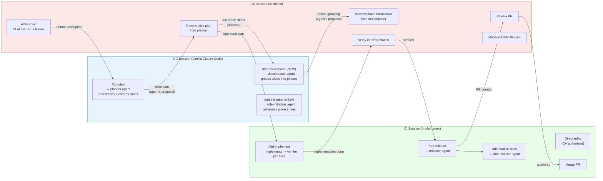
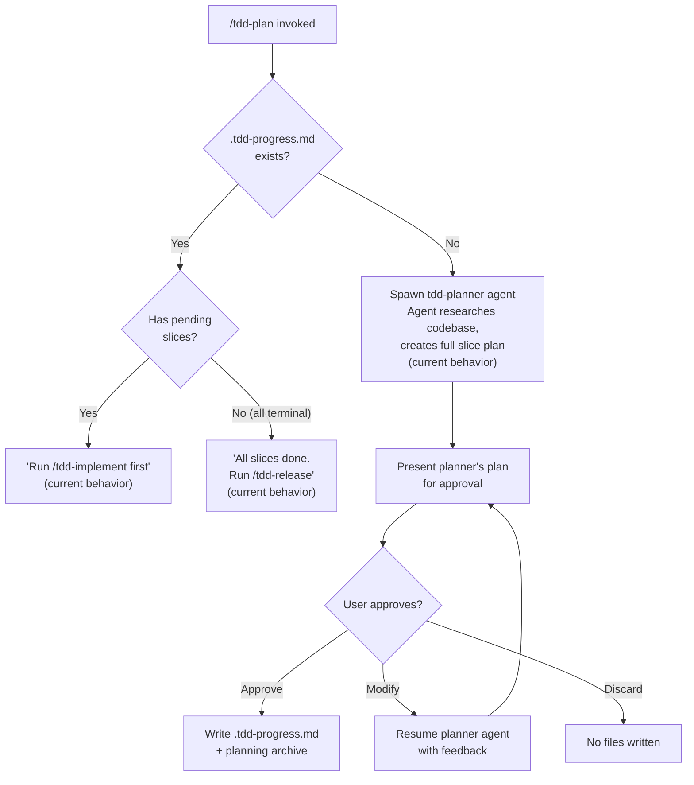
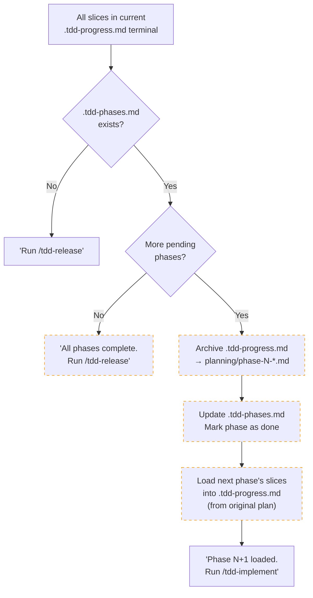
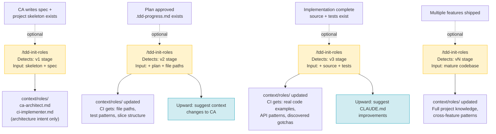
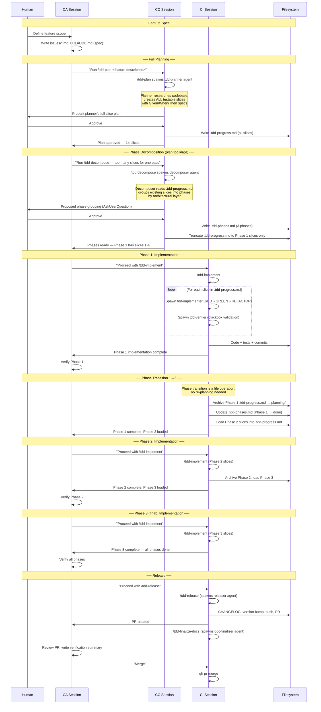

# Proposed TDD Workflow — Visual Reference

> **Date:** 2026-03-15 (revised)
> **Purpose:** Visual representation of the proposed workflow modifications
> for review before implementation. Incorporates all concepts from this
> exploration session.
>
> **Diagrams use Mermaid syntax** — render on GitHub or any Mermaid viewer.
>
> **Key principle:** The tdd-planner agent (spawned by `/tdd-plan`) is
> what researches the codebase and creates the slice plan. CA/human
> provides the feature description and reviews the result. If the plan
> has too many slices, `/tdd-decompose` groups them into phases after
> the fact — it does not create slices itself.

---

## 1. Overall Feature Lifecycle (End-to-End)

Each step shows the **agent** that does the work and its **deliverable**.
`/tdd-plan` always runs first. If the resulting plan has too many slices,
`/tdd-decompose` groups them into phases. Dashed boxes are new/modified.

```mermaid
flowchart TD
    START([Feature Request]) --> SPEC["CA + Human Dialogue<br/>─────────────────<br/>Deliverable: CLAUDE.md, issues/*.md"]

    SPEC --> PLAN["/tdd-plan<br/>Agent: tdd-planner<br/>─────────────────<br/>Deliverable: .tdd-progress.md<br/>(all slices with Given/When/Then)"]

    PLAN --> CA_REVIEW[CA Reviews<br/>Planner's Slice Plan]
    CA_REVIEW -->|Approve| DECOMPOSE_CHECK{Too many slices<br/>for one pass?}
    CA_REVIEW -->|Modify| PLAN

    DECOMPOSE_CHECK -.->|"Yes (optional)"| DECOMPOSE["/tdd-decompose ⟨NEW⟩<br/>Agent: decomposer<br/>─────────────────<br/>Deliverable: .tdd-phases.md<br/>(groups slices into phases,<br/>truncates .tdd-progress.md<br/>to Phase 1 only)"]
    DECOMPOSE_CHECK -->|No| IMPLEMENT

    DECOMPOSE --> CA_PHASES[CA Reviews<br/>Phase Grouping]
    CA_PHASES -->|Approve| IMPLEMENT
    CA_PHASES -->|Modify| DECOMPOSE

    IMPLEMENT["/tdd-implement<br/>Agents: implementer + verifier (per slice)<br/>─────────────────<br/>Deliverable: code + tests + commits"]

    IMPLEMENT --> PHASE_CHECK{".tdd-phases.md exists<br/>with more phases?"}

    PHASE_CHECK -->|"Yes → archive completed phase,<br/>load next phase's slices<br/>into .tdd-progress.md"| IMPLEMENT

    PHASE_CHECK -->|No phases or<br/>all phases done| RELEASE["/tdd-release<br/>Agent: tdd-releaser<br/>─────────────────<br/>Deliverable: CHANGELOG,<br/>version bump, push, PR"]

    RELEASE --> FINALIZE["/tdd-finalize-docs<br/>Agent: tdd-doc-finalizer<br/>─────────────────<br/>Deliverable: updated README,<br/>CLAUDE.md, docs/"]
    FINALIZE --> CA_PR[CA Reviews PR]
    CA_PR --> MERGE["CI Merges PR"]
    MERGE --> DONE([Feature Shipped])

    style DECOMPOSE stroke-dasharray: 5 5,stroke:#f90
    style PHASE_CHECK stroke-dasharray: 5 5,stroke:#f90
```



**Notes:**
- **`/tdd-plan` runs first.** The planner agent researches the codebase and
  creates ALL slices. CA reviews the result.
- **`/tdd-decompose` runs after planning**, only if the plan is too large.
  It groups the planner's existing slices into phases and truncates
  `.tdd-progress.md` to the first phase. It does NOT create slices.
- **Phase loop:** After implementing a phase, the completed phase is
  archived and the next phase's slices (already created by the planner)
  are loaded into `.tdd-progress.md`. No re-planning needed — the loop
  goes straight back to `/tdd-implement`.
- `/tdd-init-roles` is optional at any point — see Diagram 5.
- Within `/tdd-implement`, the verifier runs after each slice (internal
  detail of the skill).

---

## 2. Session Roles and Responsibilities

Shows which session (CA, CC, CI) owns each step. CP is retired. The key
insight: CC sessions run the plugin skills that spawn agents to do the
actual work. CA provides specs and reviews results. CI executes the
approved plan.



**Notes:**
- **CC is disposable.** Open, run the skill (which spawns the agent to do
  the work), close. The plugin provides everything needed — no role prompt.
- **CA and CI are persistent.** They live across all phases of a feature.
- The arrow labels emphasize that plans and breakdowns are **agent proposals**
  that CA reviews — not CA's own work product.
- **`/tdd-status`** (proposed) can be run from any session.
- **`/tdd-init-roles`** could be run from any session but CC is the
  natural home.

---

## 3. Phase Transition Detail

The lifecycle of `.tdd-progress.md` and `.tdd-phases.md` across phase
boundaries. The non-phased (single-plan) path is also shown.

```mermaid
stateDiagram-v2
    [*] --> NoFiles: Project start

    state "Non-Phased Path" as NonPhased {
        NoFiles --> ProgressOnly: /tdd-plan\n(planner creates slices)
        note right of ProgressOnly: .tdd-progress.md created
        ProgressOnly --> Implementing_NP: /tdd-implement
        Implementing_NP --> AllDone_NP: All slices terminal
        AllDone_NP --> Released: /tdd-release
    }

    state "Phased Path" as Phased {
        NoFiles --> FullPlan: /tdd-plan\n(planner creates ALL slices)
        note right of FullPlan: .tdd-progress.md with all slices

        FullPlan --> BothFiles: /tdd-decompose\n(groups slices into phases)
        note right of BothFiles: .tdd-phases.md created\n.tdd-progress.md truncated\nto Phase 1 slices only

        BothFiles --> Implementing: /tdd-implement
        Implementing --> PhaseComplete: All phase slices terminal

        PhaseComplete --> NextPhase: Archive completed phase,\nload next phase's slices\ninto .tdd-progress.md
        PhaseComplete --> AllPhasesComplete: Last phase done

        NextPhase --> Implementing

        AllPhasesComplete --> Released: /tdd-release
    }

    Released --> [*]
    note right of Released: .tdd-progress.md archived\n.tdd-phases.md: all done\n(if phased)
```

---

## 4. Decision Trees

### 4a. `/tdd-plan` — Creates the slice plan (runs once per feature)



### 4b. Phase transition (after each phase completes)

The phase transition is a lightweight file operation — no re-planning.
The planner already created all slices. This could be handled by
`/tdd-implement` (auto-advance) or a separate mechanism.



---

## 5. `/tdd-init-roles` Iterative Lifecycle

Shows when role generation/refinement can occur. Each invocation is
**optional** — the workflow functions without it. The role-initializer
agent researches whatever context exists and produces the best roles
it can.



**Key properties:**
- **Idempotent:** Each invocation diffs against existing roles, shows changes,
  asks for approval before writing.
- **Stage detection is automatic:** The skill infers the lifecycle stage from
  what files exist (skeleton only → v1, plan exists → v2, code exists → v3).
- **Two output files only:** CA + CI roles. CP is retired.
- **Bidirectional:** Generates role files *down*, suggests context improvements
  *up* to CA.

---

## 6. Component Map (Current vs. Proposed)

```
┌─────────────────────────────────────────────────────────────────────┐
│                    tdd-workflow Plugin                              │
│                                                                     │
│  AGENTS (subagents — do the actual work)                            │
│  ┌──────────────┐ ┌───────────────┐ ┌──────────────┐               │
│  │ tdd-planner   │ │tdd-implementer│ │ tdd-verifier │               │
│  │ (opus, plan)  │ │ (opus, write) │ │(haiku, plan) │               │
│  │ Researches    │ │ RED→GREEN→    │ │ Blackbox     │               │
│  │ codebase,     │ │ REFACTOR      │ │ validation   │               │
│  │ creates slices│ │               │ │              │               │
│  └──────────────┘ └───────────────┘ └──────────────┘               │
│  ┌──────────────┐ ┌───────────────┐ ┌───────────────┐              │
│  │ tdd-releaser  │ │tdd-doc-       │ │context-updater│              │
│  │(sonnet, bash) │ │finalizer      │ │ (opus, write) │              │
│  │              │ │(sonnet, edit) │ │               │              │
│  └──────────────┘ └───────────────┘ └───────────────┘              │
│  ┌ ─ ─ ─ ─ ─ ─ ─┐ ┌ ─ ─ ─ ─ ─ ─┐                                │
│  │role-initializer│ │ decomposer   │  ⟨NEW⟩ agents                  │
│  │ (opus, write)  │ │ (opus, read) │                                │
│  │ Researches     │ │ Proposes     │                                │
│  │ project, gen.  │ │ phase        │                                │
│  │ role files     │ │ breakdown    │                                │
│  └ ─ ─ ─ ─ ─ ─ ─┘ └ ─ ─ ─ ─ ─ ─┘                                │
│                                                                     │
│  SKILLS (user-invocable — orchestrate agents)                       │
│  ┌─────────────┐ ┌──────────────┐ ┌──────────────┐                 │
│  │ /tdd-plan    │ │/tdd-implement │ │ /tdd-release  │                │
│  │ (fork→plan.) │ │ (inline)     │ │(fork→release.)│                │
│  │ Spawns       │ │ Spawns impl. │ │              │                │
│  │ planner agent│ │ + verifier   │ │              │                │
│  └─────────────┘ └──────────────┘ └──────────────┘                 │
│  ┌──────────────┐ ┌──────────────┐                                  │
│  │/tdd-finalize- │ │/tdd-update-  │                                  │
│  │  docs         │ │  context     │                                  │
│  └──────────────┘ └──────────────┘                                  │
│  ┌ ─ ─ ─ ─ ─ ─ ┐ ┌ ─ ─ ─ ─ ─ ─┐ ┌ ─ ─ ─ ─ ─ ─ ┐                │
│  │/tdd-decompose │ │/tdd-init-   │ │ /tdd-status   │  ⟨NEW⟩ skills  │
│  │ Spawns        │ │  roles      │ │ (inline,      │                │
│  │ decomposer   │ │ Spawns      │ │  read-only)   │                │
│  └ ─ ─ ─ ─ ─ ─ ┘ │ role-init.  │ └ ─ ─ ─ ─ ─ ─ ┘                │
│                    └ ─ ─ ─ ─ ─ ─┘                                   │
│                                                                     │
│  SKILLS (auto-loaded, not user-invocable)                           │
│  ┌─────────────┐ ┌──────────────┐ ┌──────────────┐ ┌─────────────┐ │
│  │dart-flutter- │ │cpp-testing-  │ │bash-testing-  │ │c-conventions│ │
│  │ conventions  │ │ conventions  │ │ conventions   │ │             │ │
│  └─────────────┘ └──────────────┘ └──────────────┘ └─────────────┘ │
│                                                                     │
│  FILES (state tracking)                                             │
│  ┌──────────────────┐ ┌ ─ ─ ─ ─ ─ ─ ─ ─ ┐                         │
│  │.tdd-progress.md   │ │.tdd-phases.md     │  ⟨NEW⟩                  │
│  │(slices created by  │ │(phases created by  │                        │
│  │ planner agent,     │ │ decomposer agent,  │                        │
│  │ ephemeral per plan)│ │ persistent per     │                        │
│  │                    │ │ feature)           │                        │
│  └──────────────────┘ └ ─ ─ ─ ─ ─ ─ ─ ─ ┘                         │
│                                                                     │
│  HOOKS (in hooks.json)                                              │
│  ┌───────────────────────────────────────┐                          │
│  │ SubagentStart:                        │                          │
│  │   context-updater → git context inj.  │                          │
│  │                                       │                          │
│  │ SubagentStop:                         │                          │
│  │   tdd-implementer → R-G-R validation  │                          │
│  │   tdd-releaser    → release check     │                          │
│  │   tdd-doc-final.  → release check     │                          │
│  │                                       │                          │
│  │ Stop:                                 │                          │
│  │   check-tdd-progress.sh               │                          │
│  │                                       │                          │
│  │ ┌ ─ ─ ─ ─ ─ ─ ─ ─ ─ ─ ─ ─ ─ ─ ─ ┐  │                          │
│  │ │SessionStart: TDD session detect  │  │  ⟨NEW⟩                   │
│  │ └ ─ ─ ─ ─ ─ ─ ─ ─ ─ ─ ─ ─ ─ ─ ─ ┘  │                          │
│  └───────────────────────────────────────┘                          │
│                                                                     │
│  HOOKS (in agent frontmatter, not hooks.json)                       │
│  ┌───────────────────────────────────────┐                          │
│  │ tdd-implementer:                      │                          │
│  │   PreToolUse  → validate-tdd-order.sh │                          │
│  │   PostToolUse → auto-run-tests.sh     │                          │
│  │ tdd-planner:                          │                          │
│  │   PreToolUse  → planner-bash-guard.sh │                          │
│  └───────────────────────────────────────┘                          │
│                                                                     │
│  UTILITIES (standalone scripts, not hooks)                          │
│  ┌───────────────────────────────────────┐                          │
│  │ validate-plan-output.sh               │                          │
│  │ detect-project-context.sh             │                          │
│  │ bump-version.sh                       │                          │
│  └───────────────────────────────────────┘                          │
│                                                                     │
│  ROLE DOCS (reference, not plugin components)                       │
│  ┌─────────────────────────────────────────┐                        │
│  │ docs/dev-roles/ca-architect.md  (generic)                        │
│  │ docs/dev-roles/ci-implementer.md (generic)                       │
│  │ docs/dev-roles/cp-planner.md    (deprecated — use /tdd-plan)     │
│  └─────────────────────────────────────────┘                        │
│                                                                     │
│  PER-PROJECT OUTPUT (generated by role-initializer agent)           │
│  ┌ ─ ─ ─ ─ ─ ─ ─ ─ ─ ─ ─ ─ ─ ─ ─ ─ ─ ─ ┐                        │
│  │ <project>/context/roles/ca-architect.md  │  ⟨NEW⟩                │
│  │ <project>/context/roles/ci-implementer.md│                       │
│  └ ─ ─ ─ ─ ─ ─ ─ ─ ─ ─ ─ ─ ─ ─ ─ ─ ─ ─ ┘                        │
│                                                                     │
└─────────────────────────────────────────────────────────────────────┘

Legend:  ┌──────┐ = existing     ┌ ─ ─ ─┐ = proposed new
```

---

## 7. Phased Planning Sequence (Detailed)

A complete walkthrough of a 3-phase feature. The planner creates all
slices first, then the decomposer groups them into phases.



---

## 8. File Lifecycle Across Phases

```
Time →
────────────────────────────────────────────────────────────────────→

.tdd-progress.md:
  ┌─ALL slices──────┐
  │ created by       │  /tdd-decompose
  │ planner agent    │  truncates to
  │ (full plan)      │  Phase 1 only
  └────────┬─────────┘
           ▼
  ┌─Phase 1 slices─┐           ┌─Phase 2 slices─┐     ┌─Phase 3─┐
  │ consumed by     │ archived  │ loaded from     │ arch│ loaded  │ archived
  │ /tdd-implement  │ by next   │ original plan   │ by  │ from    │ by
  │                 │ /tdd-plan │ by /tdd-plan    │ next│ original│ /tdd-
  │                 │ ────→     │ consumed by     │ ──→ │ plan    │ release
  │                 │ planning/ │ /tdd-implement  │     │         │ ──→
  └─────────────────┘           └─────────────────┘     └─────────┘
                                                                  planning/

.tdd-phases.md (persistent, per-feature):
  Created by decomposer (after planner) ─────────────────────────→
  [Phase 1: pending]    [Phase 1: done]     [Phase 2: done]     [all done]
                        ↑ updated by        ↑ updated by
                        /tdd-plan           /tdd-plan

planning/ directory (archives):
                      phase-1-*.md          phase-2-*.md    phase-3-*.md
                      (archived)            (archived)      (archived)

Feature branch (single branch, all phases):
  ┌──created by /tdd-implement (Phase 1) ─────────────────pushed──→ PR
  │  Phase 2 and 3 commits added to same branch
```

---

## 9. Three-Session Model (Revised)

```
┌──────────────────────────────────────────────────────────┐
│                     HUMAN DEVELOPER                       │
│                                                           │
│  Provides: feature ideas, feedback, approvals, judgment   │
│  Receives: agent proposals (plans, phases, roles)         │
└─────────┬──────────────────┬──────────────────┬──────────┘
          │                  │                  │
          ▼                  ▼                  ▼
┌──────────────┐  ┌──────────────┐  ┌──────────────┐
│  CA Session   │  │  CC Session   │  │  CI Session   │
│  (Architect)  │  │  (No role)    │  │  (Implementer)│
│              │  │              │  │              │
│ Role file:   │  │ No role file │  │ Role file:   │
│ context/     │  │ Plugin gives │  │ context/     │
│ roles/       │  │ everything   │  │ roles/       │
│ ca-arch...md │  │ needed       │  │ ci-impl...md │
│              │  │              │  │              │
│ Owns:        │  │ Runs:        │  │ Runs:        │
│ • Spec       │  │ • /tdd-plan  │  │ • /tdd-      │
│ • Decisions  │  │   (planner   │  │   implement  │
│ • Issues     │  │    creates   │  │ • /tdd-      │
│ • Memory     │  │    slices)   │  │   release    │
│ • Verify     │  │ • /tdd-      │  │ • /tdd-      │
│              │  │   decompose  │  │   finalize-  │
│ Reviews:     │  │   (decomposer│  │   docs       │
│ • Planner's  │  │    creates   │  │ • Direct     │
│   slice plan │  │    phases)   │  │   edits      │
│ • Decomposer │  │ • /tdd-      │  │ • Merge PR   │
│   phases     │  │   init-roles │  │              │
│ • Impl.      │  │              │  │ Persistent:  │
│   results    │  │ Disposable:  │  │ Lives across │
│ • PR         │  │ Open, run    │  │ all phases   │
│              │  │ skill, close.│  │              │
│ Persistent:  │  │              │  │              │
│ Lives across │  │              │  │              │
│ all phases   │  │              │  │              │
└──────┬───────┘  └──────┬───────┘  └──────┬───────┘
       │                 │                 │
       │    ┌────────────┘                 │
       │    │                              │
       ▼    ▼                              ▼
┌──────────────────────────────────────────────────────────┐
│                   tdd-workflow Plugin                      │
│                                                           │
│  Agents: planner (creates slices), implementer,           │
│          verifier, releaser, doc-finalizer,                │
│          context-updater,                                  │
│          role-initializer (new), decomposer (new)         │
│                                                           │
│  Skills: /tdd-plan (modified), /tdd-implement,            │
│          /tdd-release, /tdd-finalize-docs,                │
│          /tdd-update-context,                              │
│          /tdd-decompose (new), /tdd-init-roles (new),     │
│          /tdd-status (new)                                │
│                                                           │
│  State:  .tdd-progress.md (slices by planner, per-phase)  │
│          .tdd-phases.md (phases by decomposer) (new)      │
│                                                           │
│  Hooks:  validate-tdd-order, auto-run-tests,              │
│          planner-bash-guard, check-tdd-progress,          │
│          check-release-complete, R-G-R validation,        │
│          git context injection,                            │
│          SessionStart detector (new)                      │
└──────────────────────────────────────────────────────────┘
```

---

## 10. Summary of Proposed Changes

### New Components

| Component | Type | Purpose |
|-----------|------|---------|
| `/tdd-decompose` | Skill + Agent | Groups planner's slices into phases → `.tdd-phases.md`. Runs AFTER `/tdd-plan`. |
| `/tdd-init-roles` | Skill + Agent | Role-initializer agent generates project-specific CA + CI roles (optional) |
| `/tdd-status` | Skill (inline) | Report TDD session state (phase + slice level) |
| `.tdd-phases.md` | State file | Master phase plan — tracks phase status, enables transitions |
| SessionStart hook | Hook | Auto-detect active TDD session on startup |

### Modified Components

| Component | Change |
|-----------|--------|
| `/tdd-plan` skill | No phase-related changes needed. Plans the full feature as before. |
| `/tdd-implement` skill | Phase-aware: when all slices terminal and `.tdd-phases.md` has more phases, auto-archives and loads next phase's slices. |
| `docs/dev-roles/cp-planner.md` | Deprecation notice (absorbed by `/tdd-plan` + tdd-planner agent) |

### Unchanged Components

| Component | Why Unchanged |
|-----------|---------------|
| `tdd-planner` agent | Creates slices for whatever scope it's given — phase-agnostic |
| `tdd-implementer` agent | Implements pending slices — phase-agnostic |
| `tdd-verifier` agent | Verifies any slice — phase-agnostic |
| `tdd-releaser` agent | Releases whatever is on the branch |
| `tdd-doc-finalizer` agent | Updates docs based on CHANGELOG |
| `/tdd-implement` skill | Processes pending slices in .tdd-progress.md |
| `/tdd-release` skill | Ships the feature (all phases on one branch) |
| All existing hooks | Enforcement unchanged (agent-level and plugin-level) |
| Convention skills (4) | Auto-loaded based on file type |

### Who Creates What

| Artifact | Created By | Reviewed By |
|----------|-----------|-------------|
| Feature spec (issues, CLAUDE.md) | CA + human | — |
| Slice plan (.tdd-progress.md) | Planner agent | CA + human |
| Phase grouping (.tdd-phases.md) | Decomposer agent (from planner's slices) | CA + human |
| Code + tests | Implementer agent | Verifier agent, then CA |
| Role files (context/roles/) | Role-initializer agent | CA + human |
| CHANGELOG, version | Releaser agent | CA |
| Doc updates | Doc-finalizer agent | CA |

---

*All diagrams reflect the proposed workflow as of 2026-03-15.
Render Mermaid diagrams at https://mermaid.live or on GitHub.*
