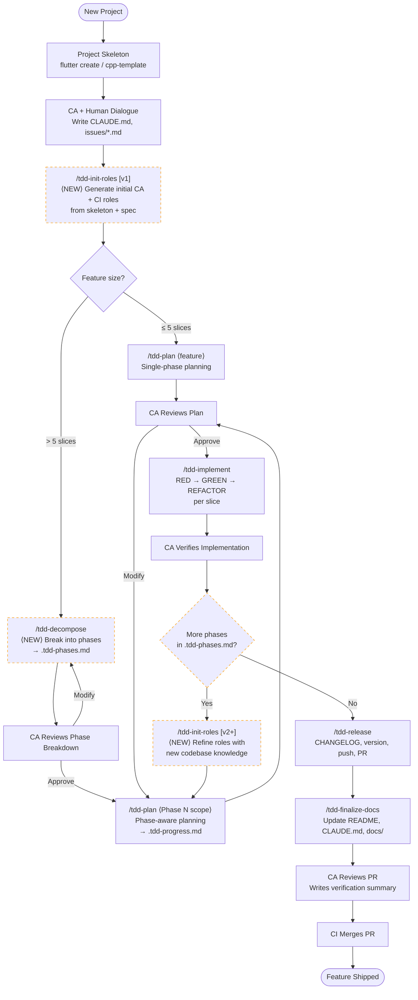
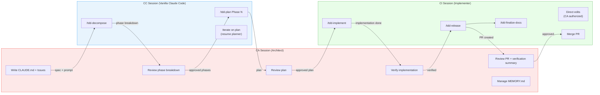
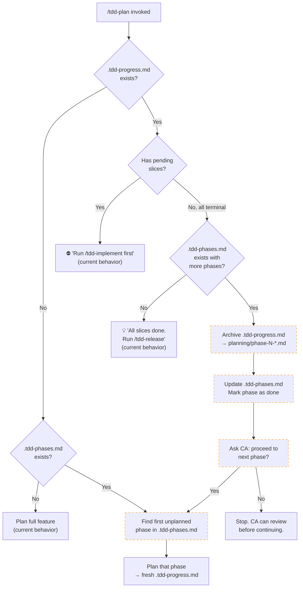
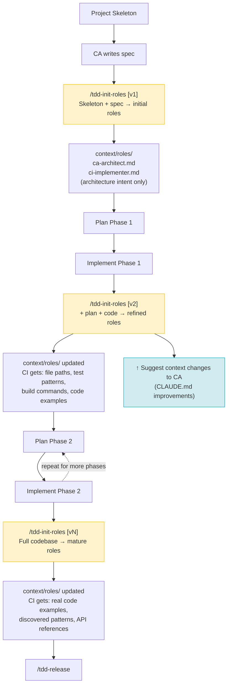
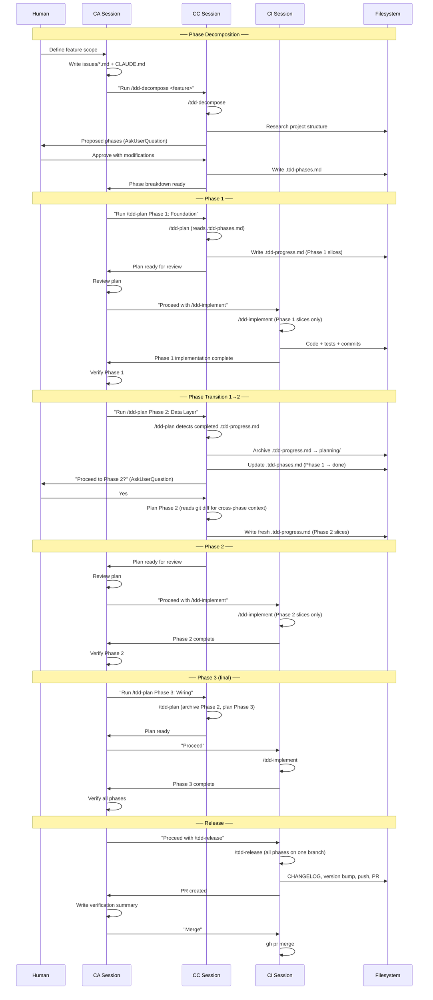

# Proposed TDD Workflow — Visual Reference

> **Date:** 2026-03-15
> **Purpose:** Visual representation of the proposed workflow modifications
> for review before implementation. Incorporates all concepts from this
> exploration session.
>
> **Diagrams use Mermaid syntax** — render on GitHub or any Mermaid viewer.

---

## 1. Overall Feature Lifecycle (End-to-End)

Shows the complete flow from empty project to shipped feature, with all
proposed components. Dashed boxes are new/modified components.



---

## 2. Session Roles and Responsibilities

Shows which session (CA, CC, CI) owns each step. CP is retired.



---

## 3. Phase Transition Detail

The critical lifecycle of `.tdd-progress.md` and `.tdd-phases.md` across
phase boundaries.

```mermaid
stateDiagram-v2
    [*] --> NoFiles: Project start

    NoFiles --> PhasesOnly: /tdd-decompose
    note right of PhasesOnly: .tdd-phases.md created<br/>All phases: pending

    PhasesOnly --> BothFiles: /tdd-plan Phase 1
    note right of BothFiles: .tdd-progress.md created<br/>(Phase 1 slices only)

    BothFiles --> Implementing: /tdd-implement
    note right of Implementing: Slices go from<br/>pending → done

    Implementing --> PhaseComplete: All slices terminal

    PhaseComplete --> PhasesOnly: /tdd-plan Phase N+1<br/>(auto-archives .tdd-progress.md<br/>updates .tdd-phases.md)

    PhaseComplete --> AllPhasesComplete: Last phase done

    AllPhasesComplete --> Released: /tdd-release
    note right of Released: .tdd-progress.md archived<br/>.tdd-phases.md: all done

    Released --> [*]
```

---

## 4. `/tdd-plan` Decision Tree (Modified)

Shows the proposed phase-aware branching logic in `/tdd-plan`.



---

## 5. `/tdd-init-roles` Iterative Lifecycle

Shows when role generation/refinement occurs relative to the development
lifecycle.



---

## 6. Component Map (Current vs. Proposed)

```
┌─────────────────────────────────────────────────────────────────────┐
│                    tdd-workflow Plugin                              │
│                                                                     │
│  AGENTS (subagents)                                                 │
│  ┌──────────────┐ ┌──────────────┐ ┌──────────────┐               │
│  │ tdd-planner   │ │tdd-implementer│ │ tdd-verifier │               │
│  │ (opus, plan)  │ │ (opus, write) │ │(haiku, plan) │               │
│  └──────────────┘ └──────────────┘ └──────────────┘               │
│  ┌──────────────┐ ┌──────────────┐ ┌──────────────┐               │
│  │ tdd-releaser  │ │tdd-doc-final.│ │context-updater│               │
│  │(sonnet, bash) │ │(sonnet, edit)│ │ (opus, write) │               │
│  └──────────────┘ └──────────────┘ └──────────────┘               │
│  ┌ ─ ─ ─ ─ ─ ─ ┐                                                  │
│  │role-initializer│  ⟨NEW⟩ Researches project, generates roles      │
│  │ (opus, write) │                                                  │
│  └ ─ ─ ─ ─ ─ ─ ┘                                                  │
│  ┌ ─ ─ ─ ─ ─ ─ ┐                                                  │
│  │ decomposer    │  ⟨NEW⟩ Breaks features into phases               │
│  │ (opus, read)  │                                                  │
│  └ ─ ─ ─ ─ ─ ─ ┘                                                  │
│                                                                     │
│  SKILLS (user-invocable)                                            │
│  ┌─────────────┐ ┌─────────────┐ ┌──────────────┐                 │
│  │ /tdd-plan    │ │/tdd-implement│ │ /tdd-release  │                 │
│  │ (fork→plan.) │ │ (inline)    │ │(fork→release.)│                 │
│  └─────────────┘ └─────────────┘ └──────────────┘                 │
│  ┌─────────────┐ ┌─────────────┐                                   │
│  │/tdd-final.-  │ │/tdd-update-  │                                   │
│  │  docs        │ │  context     │                                   │
│  └─────────────┘ └─────────────┘                                   │
│  ┌ ─ ─ ─ ─ ─ ─┐ ┌ ─ ─ ─ ─ ─ ─┐ ┌ ─ ─ ─ ─ ─ ─ ┐                │
│  │/tdd-decompose│ │/tdd-init-   │ │ /tdd-status   │  ⟨NEW⟩          │
│  │(fork→decomp.)│ │  roles      │ │ (inline)      │                 │
│  └ ─ ─ ─ ─ ─ ─┘ │(fork→role-i.)│ └ ─ ─ ─ ─ ─ ─ ┘                │
│                   └ ─ ─ ─ ─ ─ ─┘                                   │
│                                                                     │
│  SKILLS (auto-loaded, not user-invocable)                           │
│  ┌─────────────┐ ┌─────────────┐ ┌─────────────┐ ┌─────────────┐ │
│  │dart-flutter- │ │cpp-testing-  │ │bash-testing-  │ │c-conventions│ │
│  │ conventions  │ │ conventions  │ │ conventions  │ │             │ │
│  └─────────────┘ └─────────────┘ └─────────────┘ └─────────────┘ │
│                                                                     │
│  FILES (state tracking)                                             │
│  ┌─────────────────┐ ┌ ─ ─ ─ ─ ─ ─ ─ ─┐                          │
│  │.tdd-progress.md  │ │.tdd-phases.md    │  ⟨NEW⟩ Master phase plan │
│  │(current phase     │ │(all phases,       │                          │
│  │ slices, ephemeral)│ │ persistent)       │                          │
│  └─────────────────┘ └ ─ ─ ─ ─ ─ ─ ─ ─┘                          │
│                                                                     │
│  HOOKS                                                              │
│  ┌──────────────────────────────────────┐                          │
│  │ PreToolUse:  validate-tdd-order.sh   │                          │
│  │              planner-bash-guard.sh    │                          │
│  │ PostToolUse: auto-run-tests.sh       │                          │
│  │ SubagentStop: R-G-R validation       │                          │
│  │               check-release-complete │                          │
│  │ Stop:        check-tdd-progress.sh   │                          │
│  │              validate-plan-output.sh  │                          │
│  │              check-release-complete   │                          │
│  │ SubagentStart: git context injection  │                          │
│  │ ┌ ─ ─ ─ ─ ─ ─ ─ ─ ─ ─ ─ ─ ─ ─ ─ ┐ │                          │
│  │ │SessionStart: TDD session detect  │ │  ⟨NEW⟩                    │
│  │ └ ─ ─ ─ ─ ─ ─ ─ ─ ─ ─ ─ ─ ─ ─ ─ ┘ │                          │
│  └──────────────────────────────────────┘                          │
│                                                                     │
│  ROLE DOCS (reference, not components)                              │
│  ┌────────────────────────────────────────┐                        │
│  │ docs/dev-roles/ca-architect.md  (generic, bootstrap)            │
│  │ docs/dev-roles/ci-implementer.md (generic, bootstrap)           │
│  │ docs/dev-roles/cp-planner.md    (deprecated — use /tdd-plan)    │
│  └────────────────────────────────────────┘                        │
│                                                                     │
│  PER-PROJECT OUTPUT (generated by /tdd-init-roles)                  │
│  ┌ ─ ─ ─ ─ ─ ─ ─ ─ ─ ─ ─ ─ ─ ─ ─ ─ ─ ─┐                        │
│  │ context/roles/ca-architect.md  (project-specific)               │
│  │ context/roles/ci-implementer.md (project-specific)              │
│  └ ─ ─ ─ ─ ─ ─ ─ ─ ─ ─ ─ ─ ─ ─ ─ ─ ─ ─┘                        │
│                                                                     │
└─────────────────────────────────────────────────────────────────────┘

Legend:  ┌──────┐ = existing     ┌ ─ ─ ─┐ = proposed new
```

---

## 7. Phased Planning Sequence (Detailed)

A complete walkthrough of a 3-phase feature.



---

## 8. File Lifecycle Across Phases

```
Time →
────────────────────────────────────────────────────────────────────→

.tdd-phases.md:
  Created by /tdd-decompose ─────────────────────────────────────→
  [Phase 1: pending] → [Phase 1: done] → [Phase 2: done] → [all done]

.tdd-progress.md:
  ┌─Phase 1 slices─┐           ┌─Phase 2 slices─┐     ┌─Phase 3─┐
  │ created by      │ archived  │ created by      │ arch│ ...     │ archived
  │ /tdd-plan       │ ────→     │ /tdd-plan       │ ──→ │         │ ────→
  │ consumed by     │ planning/ │ consumed by     │     │         │ planning/
  │ /tdd-implement  │           │ /tdd-implement  │     │         │
  └─────────────────┘           └─────────────────┘     └─────────┘

planning/ directory:
                      phase-1-*.md          phase-2-*.md    phase-3-*.md
                      (archived)            (archived)      (archived)

Feature branch:
  ┌──created────────────────────────────────────────────pushed──→ PR
  │  by /tdd-implement (Phase 1 slices on same branch as 2 and 3)
```

---

## 9. Three-Session Model (Revised)

```
┌──────────────────────────────────────────────────────────┐
│                     HUMAN DEVELOPER                       │
│                                                           │
│  Provides: feature ideas, feedback, approvals, judgment   │
│  Receives: plans, implementation results, verification    │
└─────────┬──────────────────┬──────────────────┬──────────┘
          │                  │                  │
          ▼                  ▼                  ▼
┌──────────────┐  ┌──────────────┐  ┌──────────────┐
│  CA Session   │  │  CC Session   │  │  CI Session   │
│  (Architect)  │  │  (No role)    │  │  (Implementer)│
│              │  │              │  │              │
│ Role file:   │  │ No role file │  │ Role file:   │
│ context/     │  │ Plugin gives │  │ context/     │
│ roles/       │  │ everything   │  │ roles/       │
│ ca-arch...md │  │ needed       │  │ ci-impl...md │
│              │  │              │  │              │
│ Owns:        │  │ Runs:        │  │ Runs:        │
│ • Decisions  │  │ • /tdd-plan  │  │ • /tdd-impl. │
│ • Issues     │  │ • /tdd-decomp│  │ • /tdd-rel.  │
│ • Memory     │  │              │  │ • /tdd-fin.  │
│ • Verification│ │ Disposable:  │  │ • Direct edits│
│              │  │ Open, plan,  │  │              │
│ Persistent:  │  │ close.       │  │ Persistent:  │
│ Lives across │  │              │  │ Lives across │
│ all phases   │  │              │  │ all phases   │
└──────┬───────┘  └──────┬───────┘  └──────┬───────┘
       │                 │                 │
       │    ┌────────────┘                 │
       │    │                              │
       ▼    ▼                              ▼
┌──────────────────────────────────────────────────────────┐
│                   tdd-workflow Plugin                      │
│                                                           │
│  Agents: planner, implementer, verifier, releaser,        │
│          doc-finalizer, context-updater,                   │
│          role-initializer (new), decomposer (new)         │
│                                                           │
│  Skills: /tdd-plan, /tdd-implement, /tdd-release,         │
│          /tdd-finalize-docs, /tdd-update-context,          │
│          /tdd-decompose (new), /tdd-init-roles (new),     │
│          /tdd-status (new)                                │
│                                                           │
│  State:  .tdd-progress.md (ephemeral, per-phase)          │
│          .tdd-phases.md (persistent, per-feature) (new)   │
│                                                           │
│  Hooks:  validate-tdd-order, auto-run-tests,              │
│          check-tdd-progress, planner-bash-guard,           │
│          validate-plan-output, check-release-complete,     │
│          SessionStart detector (new)                      │
└──────────────────────────────────────────────────────────┘
```

---

## 10. Summary of Proposed Changes

### New Components

| Component | Type | Purpose |
|-----------|------|---------|
| `/tdd-decompose` | Skill + Agent | Break large features into phases |
| `/tdd-init-roles` | Skill + Agent | Generate project-specific CA + CI role files |
| `/tdd-status` | Skill (inline) | Report TDD session state (phase + slice level) |
| `.tdd-phases.md` | State file | Master phase plan (enables phase transitions) |
| SessionStart hook | Hook | Auto-detect active TDD session on startup |

### Modified Components

| Component | Change |
|-----------|--------|
| `/tdd-plan` | Phase-aware branching: archive completed phases, auto-transition |
| `docs/dev-roles/cp-planner.md` | Deprecation notice (absorbed by plugin) |

### Unchanged Components

| Component | Why Unchanged |
|-----------|---------------|
| `tdd-planner` agent | Plans whatever scope it's given — phase-agnostic |
| `tdd-implementer` agent | Implements pending slices — phase-agnostic |
| `tdd-verifier` agent | Verifies any slice — phase-agnostic |
| `tdd-releaser` agent | Releases whatever is on the branch |
| `tdd-doc-finalizer` agent | Updates docs based on CHANGELOG |
| `/tdd-implement` skill | Processes pending slices in .tdd-progress.md |
| `/tdd-release` skill | Ships the feature (all phases on one branch) |
| All hooks (except new) | Existing enforcement unchanged |
| Convention skills | Auto-loaded based on file type |

---

*All diagrams reflect the proposed workflow as of 2026-03-15.
Render Mermaid diagrams at https://mermaid.live or on GitHub.*
